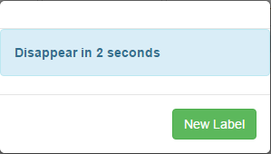

# Angular-EasyModal-alert-confirm

This easyModal can be used in AngularJS-base(with Bootstrap) web application, which is an alternative of JS alert and 
confirm dialog with enhanced functionality(html template,css,callback,external controller), more flexible, better user experience.

##Dependencies
Requires AngularJS v1.4.0+ and Bootstrap's CSS.

## Overview


### Alert Example
```
emodal.alert("<strong>Title</strong> <p></p>Disappear in 2 seconds",2000);
```
You will get the following modal:  


### Confirm Example
```
emodal.confirm("Are you sure to delete?<p></p>It is not recoverable!",
               function(){
                   //do something if OK is clicked
                   $scope.data='You have clicked OK!';
               },
               function(){
                   //do something if Cancel is clicked
                   $scope.data='You have clicked Cancel!';
               }
           );
```           
You will get the following modal:  


### Modal Example      
```
var okCallbackFun = function (arg) {
            $scope.data = '[ok callback] Parameter: '+arg.id;
        };
var cancelCallbackFun = function (arg) {
            $scope.data = '[cancel callback] Parameter: '+arg.info;
        };
$scope.showModal = function(){
            emodal.modal({
            template:'Messages go here!',
            title:'Callback Function',
            okCallback:okCallbackFun,
            okArgs:{id:1},
            cancelCallback:cancelCallbackFun,
            cancelArgs:{info:'i.e. Help text'}
            });
        };     
```        
You will get the following modal:  

           
## [Live Usage Examples](http://jsfiddle.net/ttf177/2y7q9nnm/18/) 

## [Documentation and samples](http://regisluo.github.io/angular-easymodal/)

## License

 It is available under the [MIT license](http://www.opensource.org/licenses/mit-license.php).

