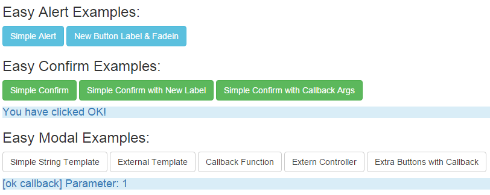

# Angular-EasyModal-alert-confirm

This easyModal can be used in AngularJS-base(with Bootstrap) web application, which is an alternative of JS alert and 
confirm dialog with enhanced functionality(html template,css,callback,external controller), more flexible, better user experience.

## Overview


### Easy Alert Example
```
emodal.alert("<strong>Title</strong> <p></p>Disappear in 2 seconds",2000);
```
You will get the following modal:


### Easy Confirm Example
```
emodal.confirm("Are you sure to delete?<p></p>It is not recoverable!",
               function(){
                   //do something if OK is pressed
                   $scope.data='You have pressed OK!';
               },
               function(){
                   //do something if Cancel is pressed
                   $scope.data='You have pressed Cancel!';
               }
           );
```           
You will get the following modal:


### Easy Modal Example      
```
var successCallbackFun = function (arg) {
            $scope.data = '[success callback] Parameter: '+arg.id;
        };
var cancelCallbackFun = function (arg) {
            $scope.data = '[cancel callback] Parameter: '+arg.info;
        };
$scope.showModal3 = function(){
            emodal.modal({template:'Messages go here!',title:'Callback Function',
                successCallback:successCallbackFun,successArgs:{id:1},
                cancelCallback:cancelCallbackFun,cancelArgs:{info:'i.e. Help text'}
            });
        };     
```        
You will get the following modal:

           
## [Live Usage Examples](http://jsfiddle.net/ttf177/2y7q9nnm/17/) 

## [Documentation and samples](http://springquay.blogspot.com/2015/12/blog-post.html)

## License

 It is available under the [MIT license](http://www.opensource.org/licenses/mit-license.php).

